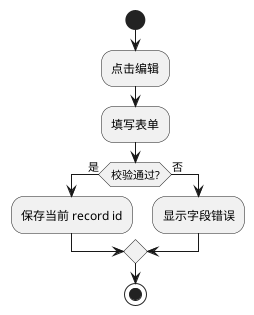

# aiopc UI Design Reference

## 何时读取本文档

仅在以下情况按需读取对应章节：用户选择 light/full `ui-design.md`、当前 change 已存在 `ui-design.md`、或正在处理 UI Design Change Request。不要在高频 `SKILL.md` 中复制本文完整模板。

## 快速路由

- 生成 UI 设计：读 §1、§2、§3、§4、§5、§8。
- 实现 UI：读 §3、§4、§6、§7、§8。
- 验收 UI：读 §3、§4、§6、§7、§9。
- 变更 UI：读 §10。

## §1 模式选择

- 不启用：纯后端、API、批处理、数据修复、配置变更、无页面/表单/按钮交互。proposal 中记录“UI 设计：未启用，原因：...”。
- light：单页面小改动、单按钮、单字段、小弹窗、已有页面局部调整。
- full：新页面、多页面、多表单、复杂交互、列表 + 表单、批量操作、高风险数据变更。

`aiopc-propose` 只推荐模式，必须让用户选择。

## §2 ui-design.md 最低模板

### light 模式

```md
# UI Design

## 元信息
- 当前版本：v1
- 状态：active
- 模式：light
- 样式精度：low
- 响应式范围：desktop-only
- 适用变更：<change-id>
- 当前有效性：本文件是本 change 的唯一 UI 实现依据

## 受影响 UI
- UI ID：<UI-PAGE-001 / UI-FORM-001 / UI-ACTION-001 / UI-STATE-001>
- 类型：Page / Form / Action / State
- 变化摘要：...

## Action Contract
涉及业务数据变更时必填；否则写“未启用，原因：...”。

## PlantUML Demo
页面结构或交互易误解时必填；否则写“未启用，原因：...”。

## 追踪矩阵
至少覆盖受影响 UI ID、AC、Task。
```

### full 模式

```md
# UI Design

## 元信息
## 页面清单
## 表单清单
## 页面设计
## 表单设计
## Action Contracts
## State Ownership
## Visibility & Enablement
## Responsive Scope
## UI Quality Baseline
## PlantUML Demo
## 追踪矩阵
## 实现任务映射
```

full 模式至少包含页面、表单、Action Contracts、PlantUML、追踪矩阵和实现任务映射。light 可升级为 full；full 降级必须走 UI Design Change Request。

## §3 稳定 UI ID

使用稳定 ID：Page=`UI-PAGE-001`，Form=`UI-FORM-001`，Action=`UI-ACTION-001`，State=`UI-STATE-001`，Field=`UI-FIELD-001`，Demo=`UI-DEMO-001`，Decision=`UI-DECISION-001`。

规则：ID 一旦创建，不因标题改名而变化；删除后不复用；变更日志记录新增、修改、废弃；tasks、acceptance、change-log、validation-report 引用 UI ID，而不是只引用标题。

## §4 Action Contract 与 State Ownership

数据变更 action 包括新增、编辑、删除、提交、启停、批量处理或改变业务数据，必须写 Action Contract：

```md
### UI-ACTION-001 <动作名>

Scope: page-level / row-level / selection-level / form-level / record-level / global-level
Target ID: <row id / record id / selected ids / none>

Payload:
| Field | Source | Submit Field | Required | Notes |
|---|---|---|---|---|

Affected Data:
- 允许影响：...

Not Affected Data:
- 禁止影响：...

UI State Changes:
- ...

Failure Behavior:
- ...

Implementation Constraints:
- row-level update 必须携带唯一目标 ID。
- 禁止没有 ID 的 row-level update。
- 禁止用表单值批量覆盖整个列表数据。

Acceptance Checks:
- 编辑第 2 行后，第 1/3 行不变。
- 失败时列表数据不变。
```

有列表、表单草稿、弹窗、选择、分页、筛选、批量操作时定义 State Ownership：

```md
| State | Owner | Scope | Can Mutate By | Must Not Mutate |
|---|---|---|---|---|
| listData | UI-PAGE-001 | page-level | 查询、分页、按 id 局部替换 | 表单输入变化 |
| editDraft | UI-FORM-001 | form-level | 打开弹窗、字段输入、重置 | 直接覆盖 listData |
```

## §5 字段、样式、权限、响应式和质量底线

表单字段使用：

```md
| UI Field ID | Label | Type | Required | Default | Validation | Data Source | Submit Field | Display Format |
|---|---|---|---|---|---|---|---|---|
```

Style Fidelity：`low` 只约束布局和组件类型；`medium` 约束布局、组件层级、按钮主次、状态展示；`high` 约束颜色、字号、间距、断点等具体视觉规格。light 默认 low；full 默认 medium。

Visibility & Enablement：

```md
| UI ID | Element | Visible When | Enabled When | Disabled/Hidden Reason | Empty/Error Behavior |
|---|---|---|---|---|---|
```

Responsive Scope：`desktop-only`、`desktop-first`、`responsive`。light 默认 desktop-only；full 默认 desktop-first；面向移动端时使用 responsive。

UI Quality Baseline：字段有可见 label；按钮文案表达结果；错误靠近字段或操作区；保存失败不能静默；主/次/危险按钮层级一致；删除、批量、不可逆操作需要二次确认；提交有 loading/disabled 防重复提交。

## §6 PlantUML Demo

默认在 `ui-design.md` 内嵌 PlantUML fenced block。复杂场景拆到 `ui-design-assets/*.puml`，并在 `ui-design.md` 引用。

拆分触发：单图超过 80 行；同一文件超过 3 张图；多页面需要多个独立线框图；图需要被单独评审。

Salt 页面线框图用于页面、表单、按钮、表格列；Activity 图用于复杂交互流程。




## §7 全流程联动

如果启用 `ui-design.md`，任何 UI 内容都要能追踪到：需求目标 -> UI Section -> AC -> Task -> 实现证据 -> 验收证据。

追踪矩阵：

```md
| UI ID | UI Section | Proposal Goal | Design Decision | Acceptance AC | Task | Implementation Evidence | Validation Evidence |
|---|---|---|---|---|---|---|---|
```

`tasks.md`：UI task 必须引用 UI ID 或 `ui-design.md` section；数据变更 task 必须引用 Action Contract；UI 变更时同步更新 task。`ui-design.md` 末尾提供实现任务映射。

`change-log.md`：每轮记录实现了哪些 UI ID、Task、AC；偏离设计必须引用已批准的 UI Design Change Request。

## §8 apply 规则

存在 `ui-design.md` 时，`aiopc-apply` 必须读取并遵守它。若 `ui-design.md` 与 acceptance/tasks 冲突，或设计不准确、不可执行，停止并草拟 UI Design Change Request。

light 模式至少做受影响 UI 的浏览器/页面级验证；full 模式按页面、表单、按钮、状态、Action Contract 检查。无法启动或浏览器验证时记录 UI Verification Blocker，不能声称 ready for acceptance。

## §9 accept 规则与证据

存在 `ui-design.md` 时，`aiopc-accept` 将其作为 UI 验收依据，验证 UI ID、Action Contract、State Ownership、追踪矩阵和关键状态。

light 至少一种 UI 证据：浏览器检查、自动化测试输出、截图、DOM/接口状态验证。full 的关键页面建议截图。数据变更 action 必须有可重复证据或前后数据记录，不能只靠截图。

建议证据目录：`openspec/changes/<change-id>/evidence/ui/`。

```md
## UI Validation
| UI ID | Expected | Result | Evidence |
|---|---|---|---|
```

## §10 UI Design Change Request

每个 change 只有一个当前有效 `ui-design.md`。批准变更后更新该文件并追加 `ui-design-change-log.md`；未批准请求放入 `ui-design-change-requests/`。

```md
# UI Design Change Request

## 变更类型
新增页面 / 删除页面 / 修改字段 / 修改按钮 / 修改样式 / 修改动作范围 / 修改状态 / 修改 PlantUML demo

## 原设计
引用 `ui-design.md` 中原始内容。

## 变更后设计
写出新的页面、字段、按钮、动作契约或 PlantUML 片段。

## 变更原因
...

## 影响分析
- 是否影响 acceptance.md：
- 是否影响 tasks.md：
- 是否影响已实现代码：
- 是否需要重新验收：
- 需要重新验收的 AC：
- 需要同步的 Task：
```
